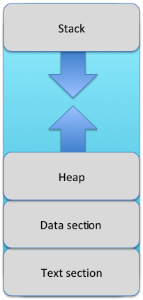
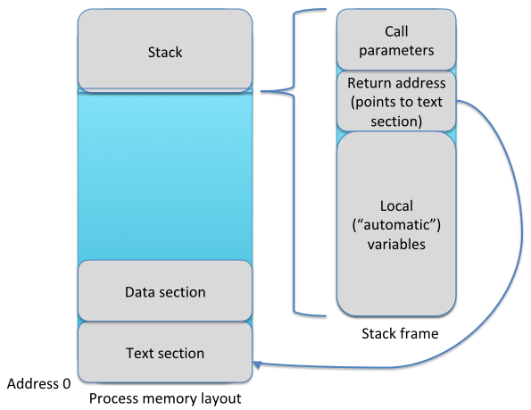
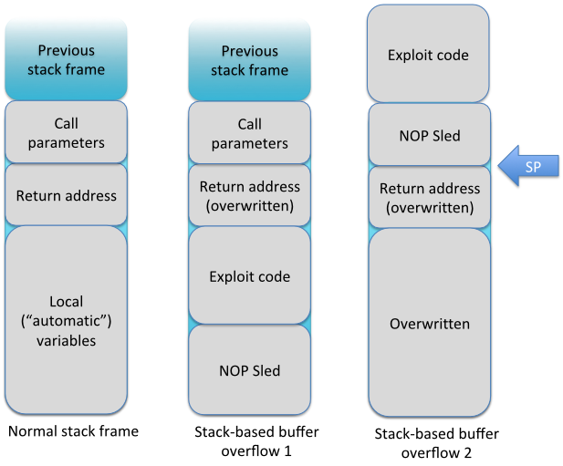

<!-- https://wiki.aalto.fi/pages/viewpage.action?pageId=133894980 -->
- [Part 1: Terminology](#part-1-terminology)
- [Part 2: A very quick demo of binary exploitation](#part-2-a-very-quick-demo-of-binary-exploitation)
- [Part 3: Discovering input processing problems with a fuzzer]
- [Part 4: Advanced Fuzzing Topics]

#### Part 1: Terminology

  * Understanding how software typically breaks is a requirement for successful secure design.
  * A way software can break is known as a weakness. A single security issue is known as a vulnerability. The weakness is exploited via one or more vulnerabilities. (Often the necessary software and activities required is called an exploit.) When you fix a security issue, you fix a vulnerability or you redesign the system not to exhibit the weakness.
  * In practice, only exploitable vulnerabilities matter. There can be weaknesses and vulnerabilities that cannot be exploited. Hence, the existence of a vulnerability is not always a proof of exploitability.
  * The act of exploitation is one type of an attack. Note that an “attack” does not imply a malicious intent: If I am testing a system legally, I am still attacking it.
> Discussion: Given the attacker, who is the defender?

  * A security risk can exist whether or not there is a weakness. A risk is a probability (likelihood) of a system having a weakness, and the impact of someone exploiting a vulnerability.
  * In many cases, the choice of whether or not to treat a risk boils down to the loss expectancy of the risk, compared to the cost of treating the risk. The tricky part here is to be able to quantify the likelihood of the risk event, which in security is usually much harder than quantifying the impact.
  * A threat is an actor that may exploit a vulnerability (or an event that someone does it). The terminology of a threat varies a bit according to source. If you want to be specific and talk about the person, talk about threat actors or something like that.
  * Weaknesses are catalogued by CWE. Vulnerabilities are catalogued by CVE.
  * Vulnerabilities are security bugs or flaws. These can be implementation-level, design-level, or even business-case level, or span several levels.
  * The way to deliver the exploit is an attack vector. The more exposure the system has, the larger attack surface it has. Usually, if a system is complex, it has more attack vector possibilities and a larger attack surface. We will get into these concepts more closely in sessions 4 and 5.
> Discussion: How could adding a security feature make a system less secure?

  * The difference between an architecture-level and implementation-level issue is fluid.
> Discussion: If your WordPress blog is hacked, is it WordPress’ bug, or was it your fault because you made the architectural decision to use WordPress?

#### Part 2: A very quick demo of binary exploitation

 > Discussion The purpose of this demo is to show how data ends up as executable code. This is probably the lowest level we go in terms of technology on this course.

 * One of the weakness categories is where an attacker gets arbitrary code to run in your system as your process.
 * This is a particularly interesting category of weaknesses, because it has a possibility of delivering very devastating attacks.
 * We will quickly remind ourselves how operating systems work:
 * Program code is loaded into memory for execution. It is executed as a process. Modern operating systems ensure that processes cannot access each others’ memory areas - except shared memory.
 * A process has several sections of memory. The executable binary code resides in the ‘text section’. The other interesting areas are the data storage areas of heap and stack. If the process has linked libraries (DLLs, SOs), the code in those libraries is also regarded as a part of the process. (This has meaning for risk analysis; plugins that are DLLs/SOs get executed with your process privileges.)
 * The following picture shows an example process layout widely shown in literature. To see a real one on Windows, use VMMap (sysinternals), on Linux, /proc/PID/maps.

A simplified image of a process memory layout

 * The processor has a register called the Instruction Pointer (which we denote by IP; do not confuse with Internet Protocol). This points to the memory address of the binary opcode to be executed by the processor.
 * When the binary performs a jump to a function, the operating system places the call parameters on the stack, followed by the current IP. When the function ends in a return opcode, the previous IP value (return address, below) is popped from the stack, and execution continues from there.
 * Also the location of the previous stack frame (“frame pointer”) is stored, and after that, memory is allocated for any local automatic variables declared in the function we just entered.
 * The stack is a collection of these stack frames. The current function is at the top of the stack (i.e., the bottommost frame in the picture).

A more detailed look at a stack frame

> Demo: We explain this all by conducting simple stack-based old-school buffer overflow exploitation on Linux. For the demo, we are using a legacy 32-bit Linux with OS’ anti-exploitation mechanisms turned off.

> Note: This also immediately leads to discussion of how exploitable vulnerabilities can be made non-exploitable through other design strategies, and again the cat-and-mouse game of how those design strategies get bypassed.

 * It may be possible for an attacker to overwrite the value of the IP stored on the stack, and thus point the processor to code selected by the attacker. We will use this ‘old-school’ technique to explain what is happening.
 * Overwriting can also impact other local variables. Integrity of those variables can change how the process executes, so buffer overflows may have security impact even without arbitrary code exection.
 * The canonical example is a buffer overflow resulting from careless memory copy operation. One such can be strcpy() in C. The issue is that one has to be really careful when using these functions, because it is very easy to copy too many bytes. If this happens, the overflowing bytes will overwrite something in the memory located after the target memory area.
 * An attacker could feed an input to the system where a programming error ends up copying the attacker-controlled input over something else. If this ‘something else’ happens to be a stack frame allocated from the stack, the attacker may be able to overwrite the IP value stored on the stack frame. Now, when the processor hits a return opcode, the processor continues execution from the IP value that the attacker overwrote the real one with.
 * The next step for the attacker is to provide some attacker-controlled code. In the easiest case, the data that overwrote the IP also contains this code, and it gets written to the stack. The attacker will then choose an IP value to overwrite the return value on the stack that will cause a jump to the attacker’s code.
 * The remaining challenge with this old-school method is that we don’t really know the memory address our exploit ends up in. Stuff like environment variables and the command name shift our code back and forth from one environment to another.
   + Hence, we need to do slight trickery, and use a method called a ‘trampoline’. Here, after the overflow and when returning from the function, the stack pointer (which points at the top of the stack) actually points to our exploit code. If we now overwrite the return address with an address that points to the text segment, into a place that translates into a jump into wherever the stack pointer is pointing (“JMP ESP”), we can always start executing our payload irrespective of the specific address it ended up in.
   + Another way to make the exploit more reliable is to pad it with “NOP sleds”, series of “No Operation” opcodes, and try to get the IP to land somewhere inside the NOP sled.

 
Stack frames. A normal stack frame on the left, exploit code below the return address in the center, and exploit code above the return address on the right.
 * This fairly simple (by modern standards) attack is becoming harder. There are various architectural aspects that contribute:
   + Stack and heap areas should not contain executable code. On modern processors, it is possible to define these memory areas as “non-executable” (NX, XN (“eXecute Never”), XD (“eXecute Disable”). The feature is enabled by DEP (“Data Execution Prevention”) on Windows. If the processor is told to jump to stack, and start executing attacker code there, the process will be terminated.
   + So called stack canaries or stack cookies are values that are written on the stack with (i.e., before) the return address, and their integrity is checked when returning. If an attacker mistakenly overwrites a stack canary, the process is terminated.
 * NX can be countered by the attacker through Return Oriented Programming (ROP). In this model, there is no executable code in a non-executable memory section. Instead, the attacker overwrites the stack with a series of return addresses, each jumping back to the main binary or one of the loaded dynamic libraries (hence sometimes also known as “Return-to-libc”).
   + The attacker will examine the target binary to find short snippets of code, called “gadgets”, and by chaining them, is able to perform something - for example, to set up parameters for a system() call and then call it. These gadgets can be found, and even exploits built, by automated tools.
 * ROP, in turn, can be countered by randomising the memory address where binaries are loaded. This way, the addresses to jump to, including those of gadgets, change from invocation to another, and it is difficult to write an exploit that reliably chains them, especially across systems. This technique is known as Address Space Layout Randomization (ASLR).
   + ASLR can be implemented in various ways. Windows executables that are linked with a specific linker option are patched at runtime so that they can run from different memory addresses. On Linux, ASLR-enabled binaries are compiled into PIE (Position Independent Executable) binaries that can be run from an arbitrary memory location. Dynamic libraries (i.e., libraries that are linked dynamically at runtime) are often prelinked (library relocation is precalculated) for performance reasons, and the relocation of libraries can be randomised in prelinking as well.
   + ASLR may have a performance penalty (e.g., with PIE on 32-bit x86 systems) or in embedded systems where libraries never change and prelinking is only done once at firmware creation stage, these strategies may not be good enough. ASLR should not be seen as a silver bullet solution (like nothing else really).
 * NX/XN, stack canaries, and ASLR are not necessarily universally in use in all targets. For example, on a certain platform, shared libraries that were not built to allow NX would also force their parent process not to have NX. Stack canaries are implemented by code in function prologue/epilogue and if not compiled in, they may be missing. ASLR might suffer from bad entropy or only partial randomisation (leading to predictability) or it might not be used for some binaries, or perhaps the underlying kernel doesn’t use ASLR. The attacker could, therefore, find modules or other executables reachable from your attack surface that just lack these protection methods.

 > Note: There is a lot to be learned in binary exploitation. I am not the right person to learn binary exploitation from, and this is not an exploitation course but instead a software security course, so this is the extent to which we go. But if you are into this sort of bit-twiddling and can live with Windows, I can personally recommend the commercial Corelan trainings (e.g., the Corelan Bootcamp), especially if you get someone to pay for it.
